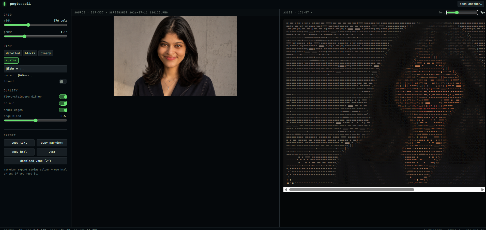

# pngtoascii

convert images to ascii art in your browser. drop a png, tweak the settings, copy it into your readme or portfolio.

**live at [pngtoascii.vercel.app](https://pngtoascii.vercel.app)**



## what it does

you drop an image (or paste it with ctrl+v) and it turns into ascii art right there. everything runs in your browser, nothing gets uploaded anywhere. you can control the width, brightness, character set, turn on dithering, edge detection or color mode, then export it as plain text, a markdown code block, html, a .txt file or even render the ascii back into a png.

the markdown export exists because i wanted ascii art in my own github readme and copying from other tools always broke the formatting. so the main export button literally wraps everything in a code fence for you.

## running it locally

```bash
git clone https://github.com/haripriyatripathi/pngtoascii.git
cd pngtoascii
bun install
bun run dev
```

opens at localhost:5173. npm works too if you don't have bun.

## how it works

the conversion pipeline is: downscale the image on an offscreen canvas, convert to grayscale using proper luminance weights, apply floyd-steinberg dithering, then map each cell's brightness to a character from the ramp. character cells are roughly twice as tall as they are wide, so the sampling compensates for that, otherwise every output looks vertically stretched.

all of this runs inside a web worker so the page never freezes, even when you drop a huge screenshot. the decoded image data is cached, so moving the sliders only re-runs the mapping step instead of re-decoding the file every time.

## problems i faced

- the first version ran everything on the main thread and a 4k screenshot froze the tab for 3 seconds. moving the conversion to a web worker fixed it but passing imagedata between threads took me a while to get right
- colored ascii output was generating megabytes of html because every single character had its own span. fixed it by merging adjacent characters of the same color into one span
- the ascii output looked stretched until i realised monospace characters aren't square. sampling has to account for the ~2:1 cell aspect ratio
- deploying was its own adventure. the app uses tanstack start with nitro for ssr, and the build was silently producing output vercel couldn't serve. took reading the build logs line by line to notice nitro wasn't running at all
- transparent pngs used to convert their background into dark characters. now alpha below a threshold just maps to a space

## what i learned

- web workers and transferable objects, and why you should never decode a file twice
- floyd-steinberg dithering. honestly the difference between dithered and non-dithered output on photos is huge, i didn't expect it
- how git history actually works. i rewrote this repo's history at one point and learned more about reflog, orphan branches and cherry-pick in one evening than in months before
- reading deployment build logs instead of guessing. the logs always know

## stack

react 19, typescript, tanstack start, tailwind v4, vite 8. no backend, no database, no analytics.

## license

mit
